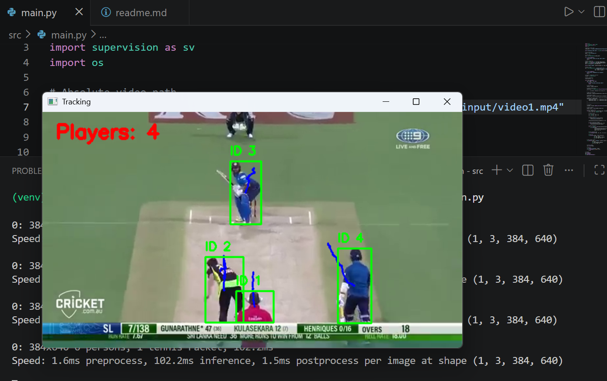
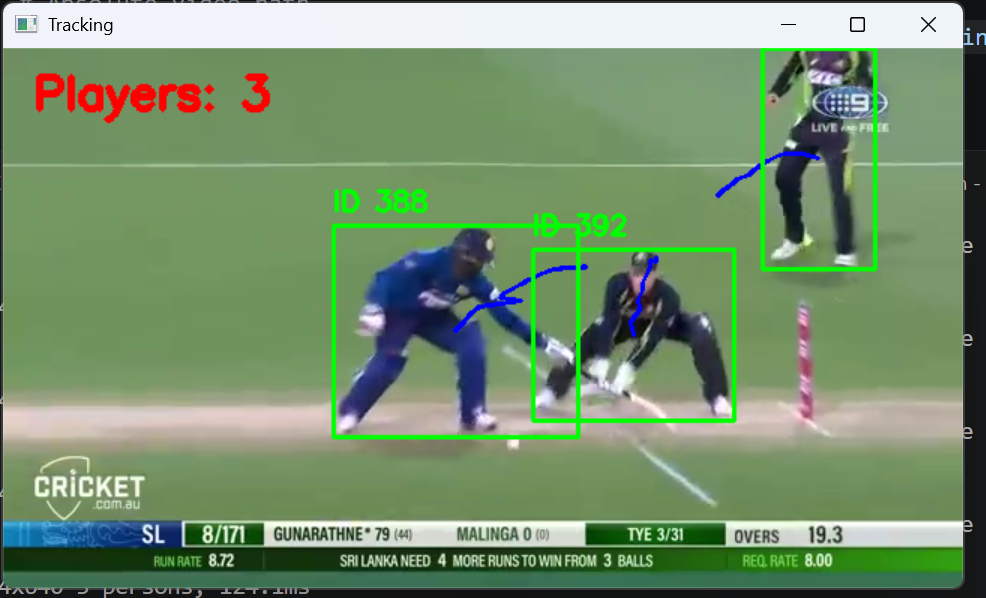
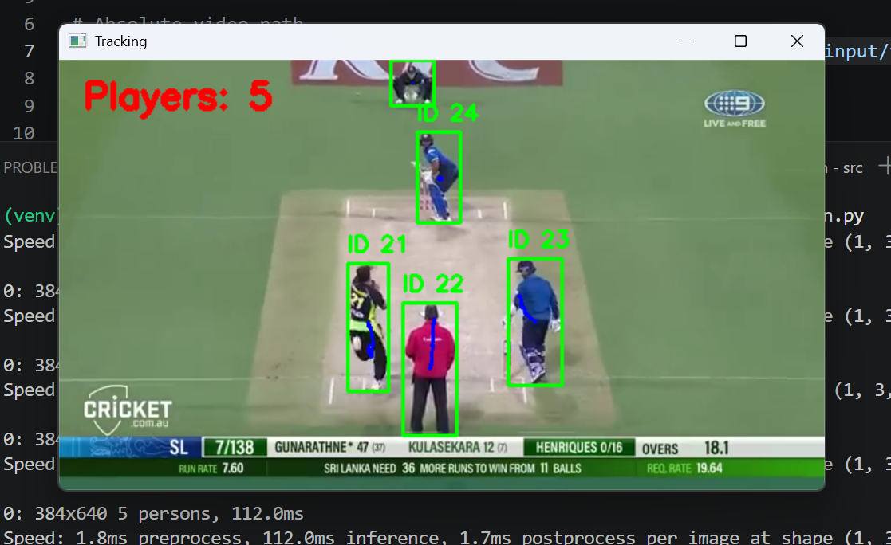
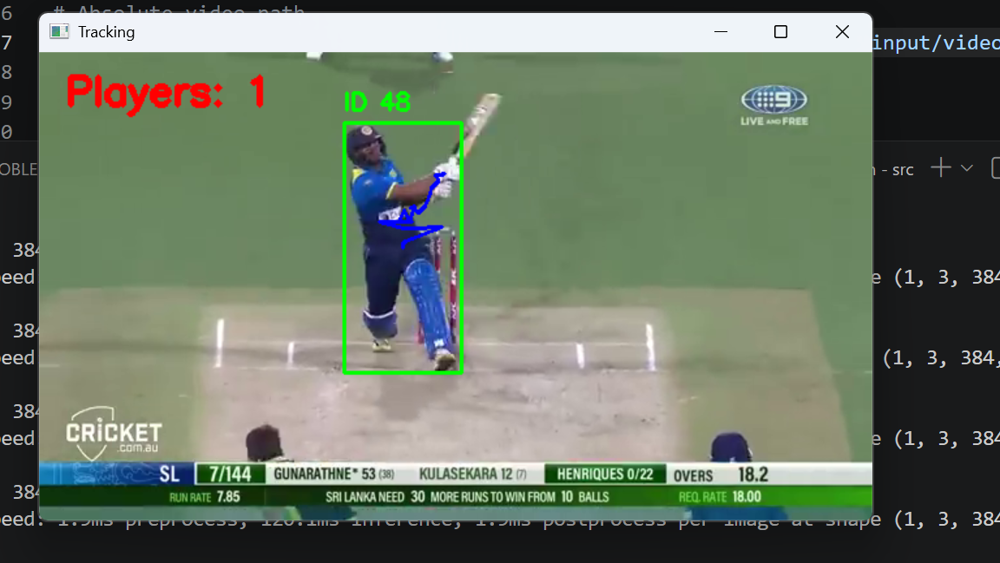
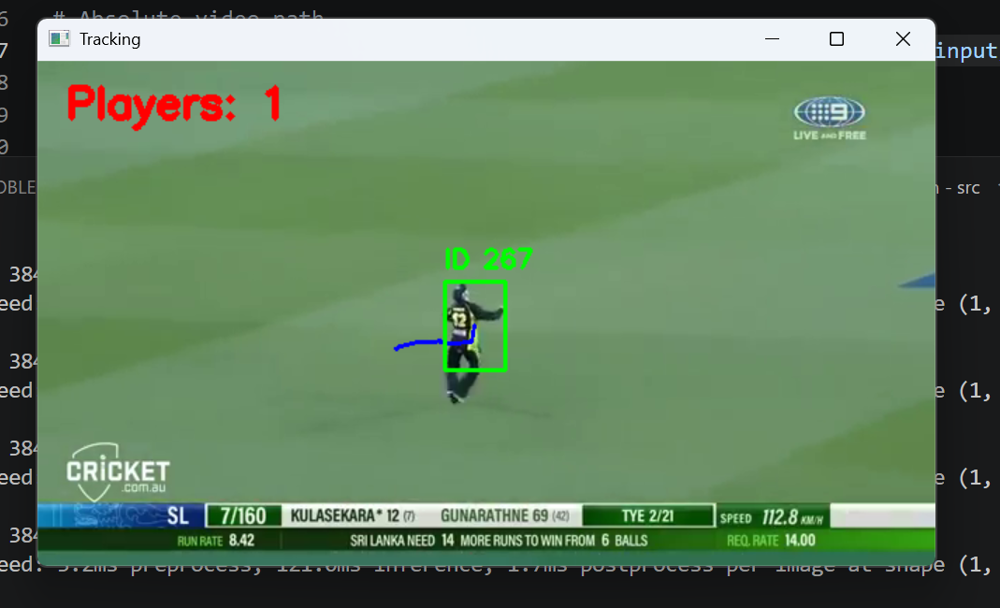
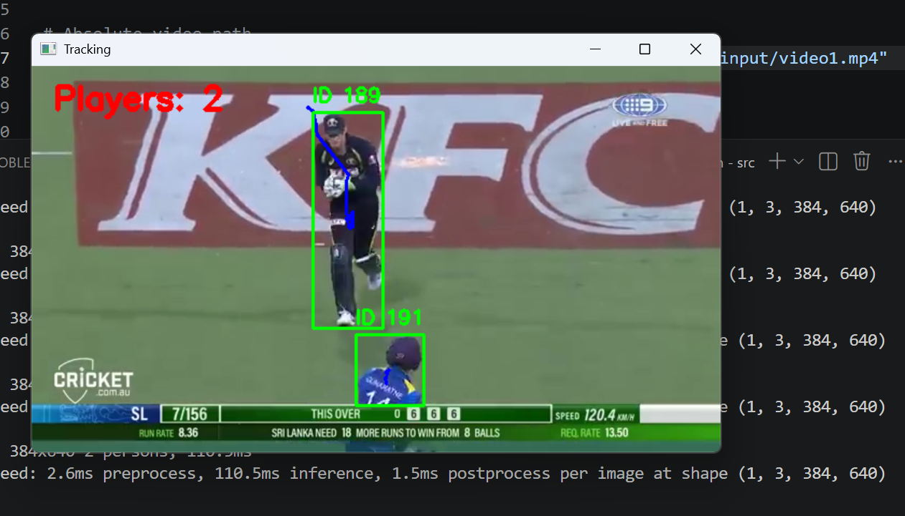

# 🎯 Multi-Object Detection and Persistent ID Tracking

## 📌 Overview

This project implements a computer vision pipeline to detect and track multiple objects (players) in a sports video. Each detected subject is assigned a unique and persistent ID across frames.


## 🚀 Features

* ✅ Object Detection using YOLOv8
* ✅ Multi-Object Tracking using ByteTrack
* ✅ Persistent Unique ID Assignment
* ✅ Trajectory Visualization (movement paths)
* ✅ Real-time Player Counting
* ✅ Annotated Output Video Generation


## 🧠 Models & Tools Used

* **YOLOv8 (Ultralytics)** → Object Detection
* **ByteTrack (Supervision Library)** → Multi-Object Tracking
* **OpenCV** → Video processing & visualization
* **NumPy** → Data handling


## ⚙️ Installation

```bash
pip install -r requirements.txt
```


## ▶️ How to Run

```bash
cd src
python main.py
```


## 📁 Project Structure

```
multi-object-tracking/
│
├── input/              # Input video
├── output/             # Output video
├── src/
│   └── main.py         # Main code
├── requirements.txt
├── README.md
└── report.pdf
```


## 🎯 Approach

1. Load input video
2. Detect objects using YOLOv8
3. Filter only person class
4. Apply confidence & size filtering
5. Track objects using ByteTrack
6. Assign persistent IDs
7. Draw bounding boxes & trajectories
8. Count players per frame
9. Save annotated output video


## ⚠️ Challenges

* Occlusion between players
* Similar appearance of players
* Fast movement in sports scenes
* Camera motion and zoom


## ❌ Limitations

* ID switching may occur in crowded scenes
* No Re-Identification (ReID) model used


## 🔮 Future Improvements

* Integrate DeepSORT with ReID
* Improve tracking stability
* Add team/player classification
* Optimize performance for real-time use


## 📹 Video Source

(https://youtu.be/6CS_mU8lj3I?si=3ZI82MbBM3trHem6)


## 📸 Sample Output

### 🎯 Detection & Tracking


### 📍 Trajectory Visualization


### Other screenshots






## 🎬 Demo Video

Due to size limitations, the demo video is hosted externally:

👉 [Watch Demo Video](https://drive.google.com/file/d/1J-TTIBLQNQ2mi76COC9CxX97wpUmUgpo/view?usp=sharing)
